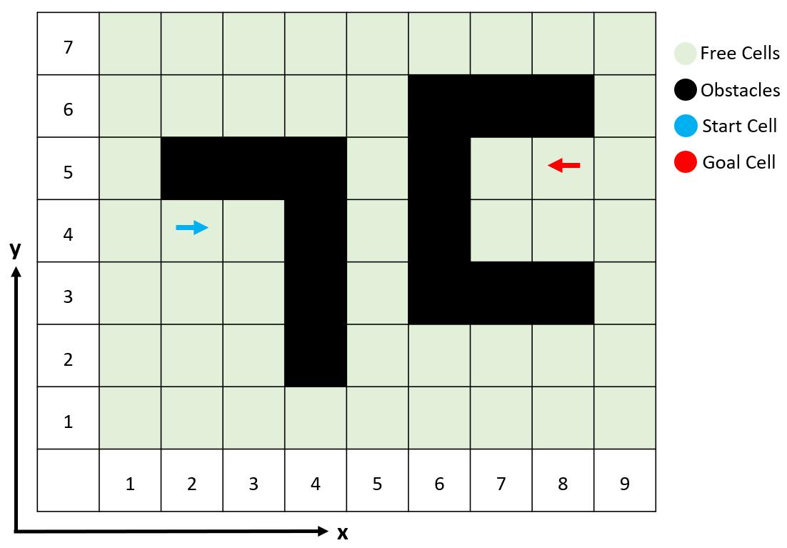

# A* algorithm 

This is an implementation of **A* algorithm** written in C++ programming language, designed to be used with different heuristics. It shows **the trace and the orientation** of the robot.

## Compiling requirements
- requires compiler support for C++11

## How to run with an example
Let's consider we have a map as below:



After running the code, you will see an output like below, here you need to enter the number of rows inside the map. For this example, we need to enter 7.

```sh
Please type the number of rows: 7
```
Then it asks about the number of column (9 in this example).
```sh
Please type the number of columns: 9
```
Next, you need to choose the heuristic distance method. The input is an integer from 1 to 4 (1.Euclidean, 2.Manhattan, 3.Diagonal, 4.Octagonal).
```sh
Please determine the heuristics method with an int from 1 to 4 (1.Euclidean, 2.Manhattan, 3.Diagonal, 4.Octagonal): 1
```
Then you need to enter the number of obstacle cells (14 in this case), and the locations of them:
```sh
Please determine the number of cells acts as obstacles: 14
Please enter the location of each obstacle:
x1: 2
y1: 5
x2: 3
y2: 5
x3: 4
y3: 5
x4: 4
y4: 4
x5: 4
y5: 3
x6: 4
y6: 2
x7: 8
y7: 6
x8: 7
y8: 6
x9: 6
y9: 6
x10: 6
y10: 5
x11: 6
y11: 4
x12: 6
y12: 3
x13: 7
y13: 3
x14: 8
y14: 3
```
Next step is defining the start point, first x, second y and finally you need to enter an integer from 1 to 4 (1. North, 2. South, 3. East, 4. West) to determine the orientation.
```sh
Please determine the location of the start Cell with integers {Sx, Sy, Syaw(1. North, 2. South, 3. East, 4. West)}: 
2
4
3
```
Finally, repeat the previous step for the goal cell.
```sh
Please determine the location of the goal Cell with integers {Gx, Gy, Gyaw(1. North, 2. South, 3. East, 4. West)}: 
8
5
4
```
The code will take care of the rest and here how the output looks like:
```sh
The goal cell is found

The Path is -> (2,4, East) -> (2,4, West) -> (1,4, West) -> (1,4, North) -> (1,5, North) -> (1,6, North) -> (1,6, East) -> (2,6, East) -> (3,6, East) -> (4,6, East) -> (5,6, East) 
-> (5,6, North) -> (5,7, North) -> (5,7, East) -> (6,7, East) -> (7,7, East) -> (8,7, East) -> (9,7, East) -> (9,7, South) -> (9,6, South) -> (9,5, South) 
-> (9,5, West) -> (8,5, West) 
The trace of the path is shown below (0 is obstacle cells, 1 is unoccupied cells, 2 is the start cell, 3 is the goal cell, and 4 are cells between the start and goal):
1 1 1 1 4 4 4 4 4 
4 4 4 4 4 0 0 0 4 
4 0 0 0 1 0 1 3 4 
4 2 1 0 1 0 1 1 1 
1 1 1 0 1 0 0 0 1 
1 1 1 0 1 1 1 1 1 
1 1 1 1 1 1 1 1 1 
```
First it shows how exactly robot needs to move. In other words, it shows both the cells occupied with the robot and its rotation as a separate action. As an example, at the start, robot wants to change its direction toward west so it rotates from in its current location (2,4,East) to (2,4,West). The output also contains the full map of the path planning (0 is obstacle cells, 1 is unoccupied cells, 2 is the start cell, 3 is the goal cell, and 4 are cells on the trace between the start and goal).

To learn more you can watch the video below:
[](https://youtu.be/zNnZtOcIQrU)
